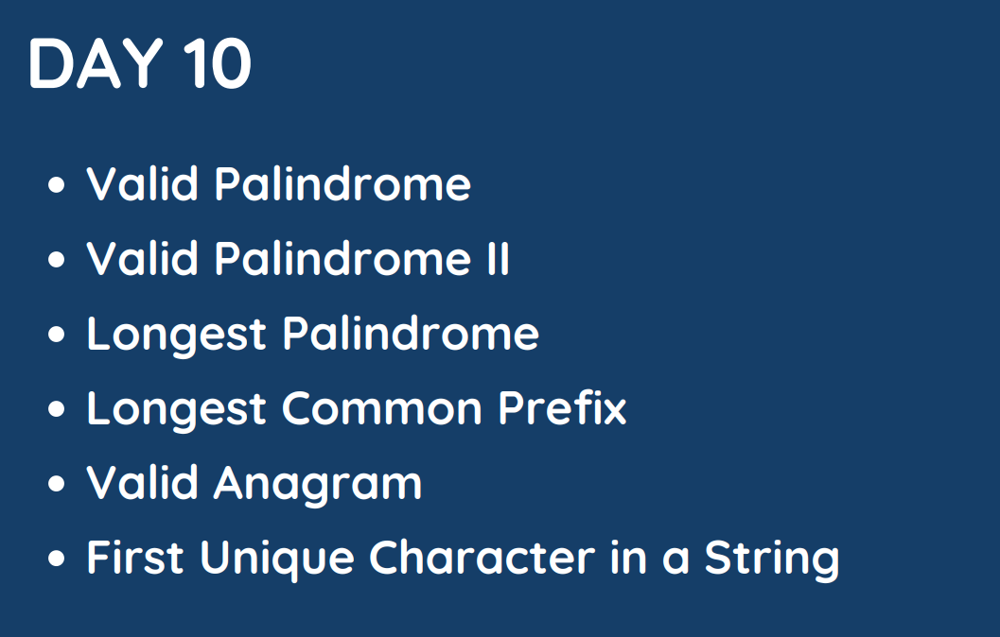

# Day : 10

## [1. Valid Palindrome](125.%20Valid%20Palindrome.md)

## [2. Valid Palindrome II](680.%20Valid%20Palindrome%20II.md)

## [3. Longest Palindrome](409.%20Longest%20Palindrome.md)

## [4. Longest Common Prefix](14.%20Longest%20Common%20Prefix.md)

## [5. Valid Anagram](14.%20Longest%20Common%20Prefix.md)

## [6. First Unique Character in a String](387.%20First%20Unique%20Character%20in%20a%20String.md)