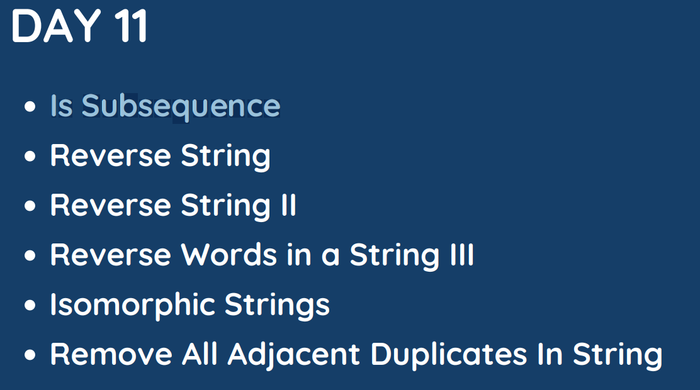

# Day 11

## [1. Is Subsequence](392.%20Is%20Subsequence.md)

## [2. Reverse String](344.%20Reverse%20String.md)

## [3. Reverse String II](541.%20Reverse%20String%20II.md)

## [4. Reverse Words in a String III](557.%20Reverse%20Words%20in%20a%20String%20III.cpp)

## [5. Isomorphic Strings](205.%20Isomorphic%20Strings.md)

## [6. Remove All Adjacent Duplicates In String](1047.%20Remove%20All%20Adjacent%20Duplicates%20In%20String.md)