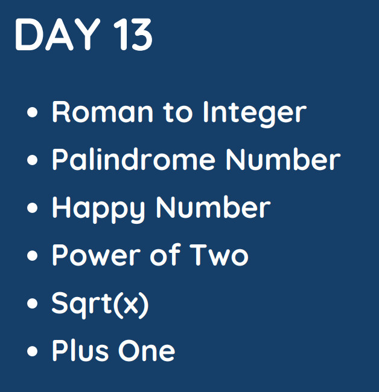

# Day 13

## [1. Roman to Integer](13.%20Roman%20to%20Integer.md)

## [2. Palindrome Number](9.%20Palindrome%20Number.md)

## [3. Happy Number](https://leetcode.com/problems/happy-number/)

## [4. Power of Two](231.%20Power%20of%20Two.md)

## [5. Sqrt(x)](69.%20Sqrt(x).md)

## [6. Plus One](66.%20Plus%20One.md)