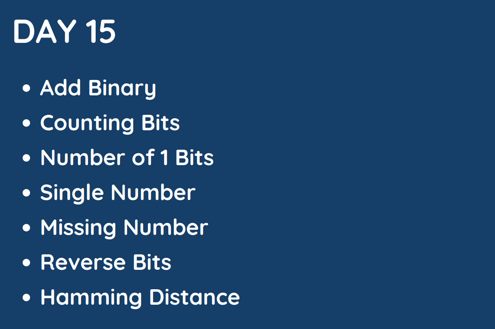

# Day 15 

## [1. Add Binary ](67.%20Add%20Binary.md)

## [2. Counting Bits ](338.%20Counting%20Bits.md)

## [3. Number of 1 Bits](191.%20Number%20of%201%20Bits.md)

## [4. Single Number ](136.%20Single%20Number.md)

## [5. Missing Number](268.%20Missing%20Number.md)

## [6. Reverse Bits](190.%20Reverse%20Bits.md)

## [7. Hamming Distance](461.%20Hamming%20Distance.md)