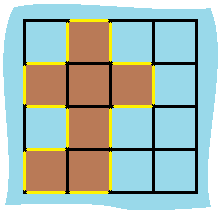

# [463. Island Perimeter](https://leetcode.com/problems/island-perimeter/)

You are given `row x col` grid representing a map where `grid[i][j] = 1` represents land and `grid[i][j] = 0` represents water.

Grid cells are connected **horizontally/vertically** (not diagonally). The `grid` is completely surrounded by water, and there is exactly one island (i.e., one or more connected land cells).

The island doesn't have "lakes", meaning the water inside isn't connected to the water around the island. One cell is a square with side length 1. The grid is rectangular, width and height don't exceed 100. Determine the perimeter of the island.


**Example 1:**



> **Input:** grid = [[0,1,0,0],[1,1,1,0],[0,1,0,0],[1,1,0,0]]<br>
**Output:** 16<br>
**Explanation:** 
The perimeter is the 16 yellow stripes in the image above.

**Example 2:**

> **Input:** grid = [[1]]<br>
**Output:** 4

**Example 3:**

> **Input:** grid = [[1,0]]<br>
**Output:** 4
 

**Constraints:**

- `row == grid.length`
- `col == grid[i].length`
- `1 <= row, col <= 100`
- `grid[i][j]` is `0` or `1`.
- There is exactly one island in `grid`.
---
# Solution

The approach of the given code is to iterate over the grid and count the number of sides of each island that are exposed to the water. The algorithm is as follows:

1. Initialize a variable `perimeter` to keep track of the total perimeter of all islands.
2. Iterate over the grid:
    * For each cell, check if it contains an island (i.e., if its value is equal to 1).
    * If it is an island, increment `perimeter` by 4.
    * Check if the cell has a neighbor to the top or left.
        * If it does, and the neighbor is also an island, decrement `perimeter` by 2.
3. Return the value of `perimeter`.

Here is a more detailed explanation of the algorithm:
```cpp
class Solution {
public:
    int islandPerimeter(vector<vector<int>>& grid) {
        int parimeter = 0;
        for(int i = 0 ; i < grid.size() ; i++){
            for(int j = 0 ; j < grid[i].size() ; j++){
                if(grid[i][j]){
                    parimeter += 4;
                    if(i != 0 && grid[i-1][j])
                        parimeter -= 2;
                    if(j != 0 && grid[i][j-1])
                        parimeter -= 2;
                }
            }
        }
        return parimeter;
    }
};
```

* When we iterate over the grid, we only need to consider the cells that contain islands.
* For each cell that contains an island, we add 4 to `perimeter`. This is because each island has four sides.
* We then check if the cell has a neighbor to the top or left. If it does, and the neighbor is also an island, we decrement `perimeter` by 2. This is because two adjacent islands share a side.
* We repeat this process for all cells in the grid.
* Finally, we return the value of `perimeter`.

This algorithm works because it counts the number of sides of each island that are exposed to the water. For example, consider the following grid:

```
0 0 0
0 1 1
0 0 1
```

This grid contains one island, which has a perimeter of 4. The algorithm will count the four sides of the island as follows:

1. Add 4 to `perimeter` because the island has four sides.
2. Decrement `perimeter` by 2 because the island has a neighbor to the left.
3. Decrement `perimeter` by 2 because the island has a neighbor to the top.
4. Return the value of `perimeter`, which is 4.

This algorithm is simple and efficient, and it works for all grids.