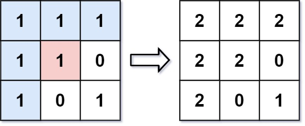

# [733. Flood Fill](https://leetcode.com/problems/flood-fill/)

An image is represented by an `m x n` integer grid image where `image[i][j]` represents the pixel value of the image.

You are also given three integers `sr`, `sc`, and `color`. You should perform a flood fill on the image starting from the pixel `image[sr][sc]`.

To perform a flood fill, consider the starting pixel, plus any pixels connected 4-directionally to the starting pixel of the same color as the starting pixel, plus any pixels connected 4-directionally to those pixels (also with the same color), and so on. Replace the color of all of the aforementioned pixels with color.

*Return the modified image after performing the flood fill.*

 

**Example 1:**



> **Input:** image = [[1,1,1],[1,1,0],[1,0,1]], sr = 1, sc = 1, color = 2<br>
**Output:** [[2,2,2],[2,2,0],[2,0,1]]<br>
**Explanation:** From the center of the image with position (sr, sc) = (1, 1) (i.e., the red pixel), all pixels connected by a path of the same color as the starting pixel (i.e., the blue pixels) are colored with the new color.<br>
Note the bottom corner is not colored 2, because it is not 4-directionally connected to the starting pixel.

**Example 2:**

> **Input:** image = [[0,0,0],[0,0,0]], sr = 0, sc = 0, color = 0<br>
**Output:** [[0,0,0],[0,0,0]]<br>
**Explanation:** The starting pixel is already colored 0, so no changes are made to the image.
 

**Constraints:**

- `m == image.length`
- `n == image[i].length`
- `1 <= m, n <= 50`
- `0 <= image[i][j], color < 216`
- `0 <= sr < m`
- `0 <= sc < n`
---
# Solution

The approach taken by the `floodFill()` function is to use a recursive depth-first search (DFS) to traverse the image and fill all connected pixels with the new color.

The algorithm works as follows:

1. The function takes four parameters as input:
    * `image`: A 2D array representing the image.
    * `sr`: The row index of the starting pixel.
    * `sc`: The column index of the starting pixel.
    * `color`: The new color to fill the region with.
2. The function first checks if the starting pixel is already the new color. If it is, then the function simply returns.
3. Otherwise, the function sets the starting pixel to the new color and then recursively calls itself on the four adjacent pixels, if they are valid and have the same color as the starting pixel.
4. The function continues recursively until all connected pixels have been filled with the new color.

Here is a step-by-step example of how the `floodFill()` function works:

```cpp
class Solution {
public:
    vector<vector<int>> floodFill(vector<vector<int>>& image, int sr, int sc, int color) {
        int val = image[sr][sc];
        int m = image.size();
        int n = image[0].size();
        // position
        image[sr][sc] = color;
        // left
        if(sr != 0 && image[sr-1][sc] == val && image[sr-1][sc] != color){
            floodFill(image,sr-1,sc,color);
        }
        // top
        if(sc != 0 && image[sr][sc-1] == val && image[sr][sc-1] != color){
            floodFill(image,sr,sc-1,color);
        }
        // right
        if(sr < m-1 && image[sr+1][sc] == val && image[sr+1][sc] != color){
            floodFill(image,sr+1,sc,color);
        }
        // down
        if(sc < n-1 && image[sr][sc+1] == val && image[sr][sc+1] != color){
            floodFill(image,sr,sc+1,color);
        }
        return image;
    }
};
```


Input: image = [[1, 1, 1], [1, 1, 0], [1, 0, 1]], sr = 1, sc = 1, color = 2

1. The function starts at the pixel (1, 1), which is the starting pixel.
2. The function checks if the starting pixel is already color 2. It is not, so the function sets it to color 2.
3. The function then recursively calls itself on the four adjacent pixels:
    * The pixel to the left (0, 1) is valid and has the same color as the starting pixel, so the function sets it to color 2.
    * The pixel to the top (1, 0) is valid and has the same color as the starting pixel, so the function sets it to color 2.
    * The pixel to the right (1, 2) is valid and has the same color as the starting pixel, so the function sets it to color 2.
    * The pixel to the bottom (2, 1) is valid and has the same color as the starting pixel, so the function sets it to color 2.
4. The function then continues recursively until all connected pixels have been filled with color 2.

Output: image = [[1, 2, 1], [2, 2, 0], [2, 0, 1]]


The `floodFill()` function is a very efficient algorithm for filling connected regions in an image. It is used in a variety of applications, such as image processing, computer graphics, and video games.