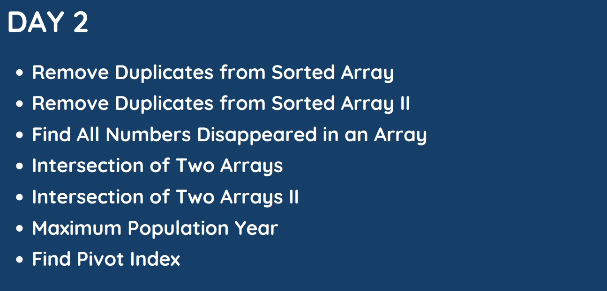

# Day : 2

## [Question 1](#question-1-remove-duplicates-from-sorted-array): [Remove Duplicates from Sorted Array](https://leetcode.com/problems/remove-duplicates-from-sorted-array/)

Given an integer array `nums` sorted in `non-decreasing order`, remove the duplicates [in-place](https://en.wikipedia.org/wiki/In-place_algorithm) such that each unique element appears only once. The relative order of the elements should be kept the same. Then return the number of unique elements in `nums`.

Consider the number of unique elements of `nums` to be `k`, to get accepted, you need to do the following things:

* Change the array `nums` such that the first `k` elements of `nums` contain the unique elements in the order they were present in `nums` initially. The remaining elements of `nums` are not important as well as the size of `nums`.
* Return k.

**Custom Judge:**
 
    The judge will test your solution with the following code:

    int[] nums = [...]; // Input array
    int[] expectedNums = [...]; // The expected answer with correct length

    int k = removeDuplicates(nums); // Calls your implementation

    assert k == expectedNums.length;
    for (int i = 0; i < k; i++) {
        assert nums[i] == expectedNums[i];
    }

If all assertions pass, then your solution will be accepted.

 

**Example 1:**

&nbsp; **Input:** nums = [1,1,2]

&nbsp; **Output:** 2, nums = [1,2,_]

&nbsp; **Explanation:** Your function should return k = 2, with the first two elements of nums being 1 and 2 respectively.
It does not matter what you leave beyond the returned k (hence they are underscores).

**Example 2:**

&nbsp; **Input:** nums = [0,0,1,1,1,2,2,3,3,4]

&nbsp; **Output:** 5, nums = [0,1,2,3,4,_,_,_,_,_]

&nbsp; **Explanation:** Your function should return k = 5, with the first five elements of nums being 0, 1, 2, 3, and 4 respectively.
It does not matter what you leave beyond the returned k (hence they are underscores).
 

**Constraints:**

* `1 <= nums.length <= 3 * 104`
* `-100 <= nums[i] <= 100`
* `nums` is sorted in non-decreasing order.

## Solution

**Approach:**

The approach is to scan the input array `nums` from left to right. At each iteration, we compare the current element `nums[i]` with the next element `nums[i + 1]`. If they are not equal, we copy `nums[i + 1]` to the next available position in the output array, and increment the counter `res`.

Once we have scanned the entire input array, we use the `erase()` method to remove all elements from the output array after position `res`. This ensures that the output array only contains the unique elements from the input array.

**Algorithm:**

    int removeDuplicates(vector<int>& nums) {
    // Initialize the result array and the counter.
    int res = 1;

    // Iterate over the input array.
    for (int i = 0; i < nums.size() - 1; i++) {
        // If the current element is not equal to the next element, copy the next element to the result array.
        if (nums[i] != nums[i + 1]) {
            nums[res++] = nums[i + 1];
        }
    }

    // Remove all elements from the result array after position `res`.
    nums.erase(nums.begin() + res, nums.end());

    // Return the number of unique elements in the input array.
    return res;
    }

1. Initialize a variable `res` to `1`. This will be the index of the next available element in the new array.
2. Iterate through the array, starting from index `0`.
    * If the current element is not equal to the next element, then copy the current element to the new array at index `res`.
    * Increment `res` by `1`.
3. Erase the elements from the original array after index `res`.
4. Return `res`.

## [Question 2](#question-2): [Remove Duplicates from Sorted Array II](https://leetcode.com/problems/remove-duplicates-from-sorted-array-ii/)

Given an integer array `nums` sorted in non-decreasing order, remove some duplicates [in-place](https://en.wikipedia.org/wiki/In-place_algorithm) such that each unique element appears at most twice. The relative order of the elements should be kept the same.

Since it is impossible to change the length of the array in some languages, you must instead have the result be placed in the first part of the array `nums`. More formally, if there are k elements after removing the duplicates, then the first `k` elements of `nums` should hold the final result. It does not matter what you leave beyond the first `k` elements.

Return `k` after placing the final result in the first `k` slots of `nums`.

Do not allocate extra space for another array. You must do this by modifying the input array [in-place](https://en.wikipedia.org/wiki/In-place_algorithm) with `O(1)` extra memory.

**Custom Judge:**

The judge will test your solution with the following code:

    int[] nums = [...]; // Input array
    int[] expectedNums = [...]; // The expected answer with correct length

    int k = removeDuplicates(nums); // Calls your implementation

    assert k == expectedNums.length;
    for (int i = 0; i < k; i++) {
        assert nums[i] == expectedNums[i];
    }
If all assertions pass, then your solution will be accepted.

**Example 1:**

&nbsp; **Input:** nums = [1,1,1,2,2,3]

&nbsp; **Output:** 5, nums = [1,1,2,2,3,_]

&nbsp; Explanation: Your function should return k = 5, with the first five elements of nums being 1, 1, 2, 2 and 3 respectively.
It does not matter what you leave beyond the returned k (hence they are underscores).

**Example 2:**

&nbsp; **Input:** nums = [0,0,1,1,1,1,2,3,3]

&nbsp; **Output:** 7, nums = [0,0,1,1,2,3,3,_,_]

&nbsp; Explanation: Your function should return k = 7, with the first seven elements of nums being 0, 0, 1, 1, 2, 3 and 3 respectively.
It does not matter what you leave beyond the returned k (hence they are underscores).
 

**Constraints:**

* `1 <= nums.length <= 3 * 104`
* `-104 <= nums[i] <= 104`
* `nums` is sorted in non-decreasing order.

## Solution

**Approach:**

The approach is to maintain two counters, `n` and `times`. `n` keeps track of the number of unique elements in the array, and `times` keeps track of the number of consecutive duplicate elements.

The algorithm works as follows:

1. Initialize `n` to `1` and times to `0`.
2. Iterate over the array from index `1` to `nums.size() - 1`.
3. If the current element is equal to the previous element, increment `times`.
    * If `times` is less than 2, then add the current element to the unique array.
    * Otherwise, do nothing.
4. If the current element is not equal to the previous element, then set `times` to 0.
    * Add the current element to the unique array.
5. After the loop, erase the duplicate elements from the original array.

**Algorithm:**

**C++**

    int removeDuplicates(vector<int>& nums) {
    // 1. Initialize `n` and `times`.
    int n = 1;
    int times = 0;

    // 2. Iterate over the array from index 1 to `nums.size() - 1`.
    for (int i = 1; i < nums.size(); i++) {

        // 3. If the current element is equal to the previous element, increment `times`.
        if (nums[i] == nums[i - 1]) {
        times++;

        // 3.1 If `times` is less than 2, then add the current element to the unique array.
        if (times < 2) {
            nums[n++] = nums[i];
        }
        }

        // 4. If the current element is not equal to the previous element, then set `times` to 0.
        else {
        times = 0;

        // 4.1 Add the current element to the unique array.
        nums[n++] = nums[i];
        }
    }

    // 5. After the loop, erase the duplicate elements from the original array.
    nums.erase(nums.begin() + n, nums.end());

    return n;
    }

## [Question 3](#question-3): [Find All Numbers Disappeared in an Array](https://leetcode.com/problems/find-all-numbers-disappeared-in-an-array/)
Given an array `nums` of n integers where `nums[i]` is in the range `[1, n]`, return an array of all the integers in the range `[1, n]` that do not appear in `nums`.

 

**Example 1:**

&nbsp; **Input:** nums = [4,3,2,7,8,2,3,1]
&nbsp;  **Output:** [5,6]

**Example 2:**

&nbsp; **Input:** nums = [1,1]
&nbsp; **Output:** [2]

**Constraints:**

* n == nums.length
* 1 <= n <= 105
* 1 <= nums[i] <= n

## Solution
**Approach:**

The approach of the code is to mark all the numbers that are present in the list as negative. The missing numbers will be the ones that are still positive.

**Algorithm:**

1. Initialize a vector `res` to store the missing numbers.
2. Iterate over the list `nums`.
    * For each number `num`:
    * If `nums[abs(num) - 1] < 0`: continue.
    * Otherwise: nums[abs(num) - 1] *= -1.
3. Iterate over the list nums again.
    * For each number num:
        * If `num > 0`: push `num + 1` to the vector `res`.
4. Return the vector `res`.

**CODE CPP**

    vector<int> findDisappearedNumbers(vector<int>& nums) {
        int n = nums.size();
        for(int i = 0 ; i < n ; i++){
            if(nums[abs(nums[i])-1] < 0)
                continue;
            nums[abs(nums[i])-1] *= -1;
        }
        
        vector<int> res;

        for(int i=0;i<n;i++)
            if(nums[i]>0)
                res.push_back(i+1);
        
        return res;
    }

**Here is a more detailed explanation of the code:**

1. The first step is to initialize a vector `res` to store the missing numbers. This vector will be empty at the beginning.
2. The next step is to iterate over the list `nums`. For each number `num` in the list, we do the following:
    * If the number `nums[abs(num) - 1]` is already negative, then that means the number num has already been marked as missing. So, we just continue to the next number.
    * Otherwise, we mark the number `num` as missing by multiplying it by -1.
    3. After we have iterated over the entire list `nums`, we iterate over it again. This time, we only add the numbers that are still positive to the vector `res`. These are the missing numbers.
    4. Finally, we return the vector `res`.

This algorithm works because it ensures that each number in the list is marked as either present or missing. The missing numbers are the ones that are still positive after we have iterated over the list twice.

## [Question 4](#question-4): [Intersection of Two Arrays](https://leetcode.com/problems/intersection-of-two-arrays/description/)
Given two integer arrays `nums1` and `nums2`, return an array of their intersection. Each element in the result must be unique and you may return the result in **any order**.

**Example 1:**

&nbsp; **Input:** nums1 = [1,2,2,1], nums2 = [2,2]

&nbsp; **Output:** [2]

**Example 2:**

&nbsp; **Input:** nums1 = [4,9,5], nums2 = [9,4,9,8,4]

&nbsp; **Output:** [9,4]

&nbsp; **Explanation:** [4,9] is also accepted.
 

**Constraints:**

* `1 <= nums1.length, nums2.length <= 1000`
* `0 <= nums1[i], nums2[i] <= 1000`

## Solution

