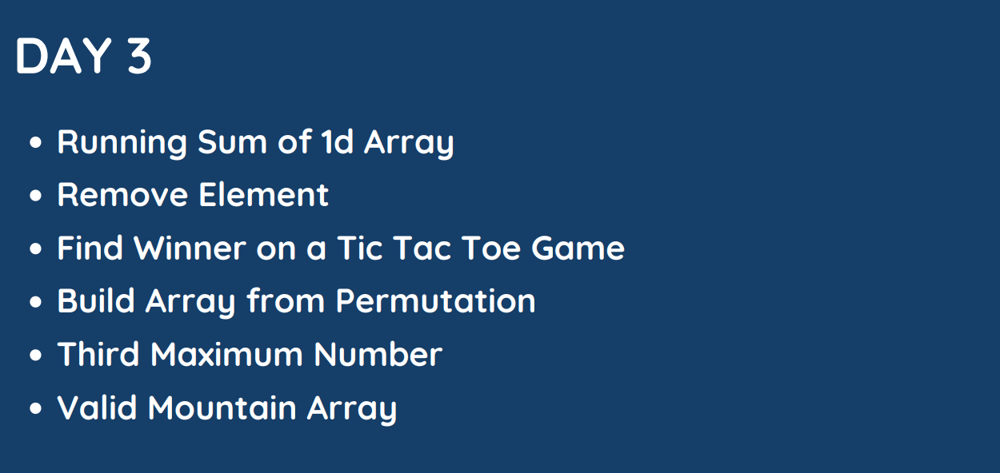

# Day : 3



## [Question 1](#question-1): [Running Sum of 1d Array](https://leetcode.com/problems/running-sum-of-1d-array)
Given an array `nums`. We define a running sum of an array as `runningSum[i] = sum(nums[0]…nums[i])`.

Return the running sum of `nums`. 

**Example 1:**

&nbsp; **Input:** nums = [1,2,3,4]

&nbsp; **Output:** [1,3,6,10]

&nbsp; **Explanation:** Running sum is obtained as follows: [1, 1+2, 1+2+3, 1+2+3+4].

**Example 2:**

&nbsp; **Input:** nums = [1,1,1,1,1]

&nbsp; **Output:** [1,2,3,4,5]

&nbsp; **Explanation:** Running sum is obtained as follows: [1, 1+1, 1+1+1, 1+1+1+1, 1+1+1+1+1].
Example 3:


&nbsp; **Input:** nums = [3,1,2,10,1]

&nbsp; **Output:** [3,4,6,16,17]
 

**Constraints:**
* `1 <= nums.length <= 1000`
* `-10^6 <= nums[i] <= 10^6`

## Solution
**Approach:**

The approach of the code is to calculate the running sum of the elements in the input array. The running sum of an array is the sum of all the elements up to and including the current element.

**Algorithm:** The algorithm of the code is as follows:

1. Initialize a variable `size` to the size of the input array.
2. For each element `i` in the array, starting from index `1`:
    * Set `nums[i] += nums[i-1]`.
3. Return the array `nums`.

**Here is an explanation of the algorithm steps:**

1. The first step initializes the variable size to the `size` of the input array. This is necessary because we need to know how many elements are in the array in order to iterate over them.
2. The second step is the main loop of the algorithm. It iterates over the elements in the array, starting from index 1.
3. In each iteration of the loop, we add the previous element to the current element. This gives us the running sum of the elements up to and including the current element.
4. The last step returns the array `nums`. This is the array with the running sums of the elements.


**Here is the C++ code for the algorithm:**

**C++ CODE**

    vector<int> runningSum(vector<int>& nums) {
    int size = nums.size();

    for (int i = 1; i < size; i++) {
        nums[i] += nums[i - 1];
    }

    return nums;
    }

It first initializes a variable `size` to the size of the input array. Then, it iterates over the elements in the array, starting from index 1. In each iteration, it adds the previous element to the current element and stores the result in the current element. Finally, it returns the array `nums`.

## [Question 2](#question-2): [Remove Element](https://leetcode.com/problems/remove-element/)
Given an integer array nums and an integer `val`, remove all occurrences of `val` in `nums` [in-place](https://en.wikipedia.org/wiki/In-place_algorithm). The order of the elements may be changed. Then return the *number of elements* in `nums` which are not equal to `val`.

Consider the number of elements in `nums` which are not equal to `val` be `k`, to get accepted, you need to do the following things:

* Change the array `nums` such that the first `k` elements of `nums` contain the elements which are not equal to `val`. The remaining elements of `nums` are not important as well as the size of `nums`.
* Return `k`.

**Custom Judge:**

The judge will test your solution with the following code:

    int[] nums = [...]; // Input array
    int val = ...; // Value to remove
    int[] expectedNums = [...]; // The expected answer with correct length.
                                // It is sorted with no values equaling val.

    int k = removeElement(nums, val); // Calls your implementation

    assert k == expectedNums.length;
    sort(nums, 0, k); // Sort the first k elements of nums
    for (int i = 0; i < actualLength; i++) {
        assert nums[i] == expectedNums[i];
    }

If all assertions pass, then your solution will be accepted.

 

**Example 1:**

&nbsp; **Input:** nums = [3,2,2,3], val = 3

&nbsp; **Output:** 2, nums = [2,2,_,_]

&nbsp; **Explanation:** Your function should return k = 2, with the first two elements of nums being 2.
It does not matter what you leave beyond the returned k (hence they are underscores).

**Example 2:**

&nbsp; **Input:** nums = [0,1,2,2,3,0,4,2], val = 2

&nbsp; **Output:** 5, nums = [0,1,4,0,3,_,_,_]

&nbsp; **Explanation:** Your function should return k = 5, with the first five elements of nums containing 0, 0, 1, 3, and 4.
Note that the five elements can be returned in any order.
It does not matter what you leave beyond the returned k (hence they are underscores).
 

**Constraints:**
* `0 <= nums.length <= 100`
* `0 <= nums[i] <= 50`
* `0 <= val <= 100`

## Solution
**Approach:**

The approach is to scan the array from left to right, and for each element, if it is not equal to `val`, then move it to the front of the array. After the scan, the elements at the end of the array are all equal to `val`, so we can simply remove them using the `erase()` method.

**Algorithm:**

1. Initialize a variable `n` to store the number of elements that are not equal to `val`.
2. Iterate through the array from left to right.
    * If the current element is not equal to `val`, then do the following:
        * Move the current element to the front of the array by swapping it with the element at index `n`.
        * Increment `n` by `1`.
3. Use the `erase()` method to remove the elements from index `n` to the end of the array.
4. Return `n`.

**Here is the detailed explanation of the code:**

**C++ COde**

    int removeElement(vector<int>& nums, int val) {
    // Initialize the number of elements that are not equal to val
    int n = 0;

    // Iterate through the array
    for (int i = 0; i < nums.size(); i++) {
        // If the current element is not equal to val, move it to the front of the array
        if (nums[i] != val) {
        nums[n++] = nums[i];
        }
    }

    // Remove the elements from index n to the end of the array
    nums.erase(nums.begin() + n, nums.end());

    // Return the number of elements that are not equal to val
    return n;
    }

**Complexity:**

The time complexity of the algorithm is `O(n)`, where `n` is the number of elements in the `nums` vector. This is because the first loop iterates through the entire vector, and the second loop only executes `n` times.

The space complexity of the algorithm is `O(1)`, because the only additional space that is used is a variable to keep track of the number of elements.

## [Question 3](#question-3): [Find Winner on a Tic Tac Toe Game](https://leetcode.com/problems/find-winner-on-a-tic-tac-toe-game/)
Tic-tac-toe is played by two players `A` and `B` on a `3 x 3` grid. The rules of Tic-Tac-Toe are:

* Players take turns placing characters into empty squares `' '`.
* The first player `A` always places `'X'` characters, while the second player `B` always places `'O'` characters.
* `'X'` and `'O'` characters are always placed into empty squares, never on filled ones.
* The game ends when there are three of the same (non-empty) character filling any row, column, or diagonal.
* The game also ends if all squares are non-empty.
* No more moves can be played if the game is over.

Given a 2D integer array `moves` where `moves[i] = [rowi, coli]` indicates that the ith move will be played on `grid[rowi][coli]`. return *the winner of the game* if it exists (A or B). In case the game ends in a draw return "Draw". If there are still movements to play return `"Pending"`.

You can assume that `moves` is valid (i.e., it follows the rules of **Tic-Tac-Toe**), the grid is initially empty, and `A` will play first.

**Example 1:**


&nbsp; **Input:** moves = [[0,0],[2,0],[1,1],[2,1],[2,2]]

&nbsp; **Output:** "A"

&nbsp; **Explanation:** A wins, they always play first.

**Example 2:**


&nbsp; **Input:** moves = [[0,0],[1,1],[0,1],[0,2],[1,0],[2,0]]

&nbsp; **Output:** "B"

&nbsp; **Explanation:** B wins.

**Example 3:**


&nbsp; **Input:** moves = [[0,0],[1,1],[2,0],[1,0],[1,2],[2,1],[0,1],[0,2],[2,2]]

&nbsp; **Output:** "Draw"

&nbsp; **Explanation:** The game ends in a draw since there are no moves to make.
 

**Constraints:**

* `1 <= moves.length <= 9`
* `moves[i].length == 2`
* `0 <= rowi, coli <= 2`
* There are no repeated elements on `moves`.
* `moves` follow the rules of tic tac toe.

## Solution

**Approach:**

The code first checks if the game has not yet reached a win condition or a draw. If it has, the code returns the appropriate string. Otherwise, the code iterates over the moves vector and makes the corresponding move on the board. If the move results in a win for the current player, the code returns the player's name. Otherwise, the code makes the next move and repeats the process. If the game reaches the end without a winner, the code returns `"Draw"`.

1. Initialize a 3x3 game board with empty cells represented by the character `'0'`.
2. Iterate through the moves made by players `'A'` and `'B'`.
3. For each move, update the game board with the corresponding player's symbol (`'A'` or `'B'`).
4. After each move, check if the current player has won the game using the is_winner function.
5. If a player wins, return the player's symbol (`'A'` or `'B'`).
6. If the game ends in a draw (all cells are filled), return `"Draw"`.
7. If the game is ongoing and has not reached a conclusion, return `"Pending"`.

**is_winner() function Code**
    
    bool is_winner(char board[3][3], char player) {
        // Check for a win condition
        for (int i = 0; i < 3; ++i) {
            if (
                (board[i][0] == board[i][1] && board[i][1] == board[i][2] && board[i][2] == player) ||
                (board[0][i] == board[1][i] && board[1][i] == board[2][i] && board[2][i] == player)
            ) 
                return true;
        }
        
        // Check diagonals
        if (
            (board[0][0] == board[1][1] && board[1][1] == board[2][2] && board[2][2] == player) ||
            (board[0][2] == board[1][1] && board[1][1] == board[2][0] && board[2][0] == player)
        )
            return true;
        
        return false;
    }

**Solved Problem Code**

    string tictactoe(vector<vector<int>>& moves) {
        if (moves.size() < 5)
            return "Pending";
        
        char board[3][3] = {}; // Initialize the 3x3 game board with zeros
        
        for (int i = 0; i < moves.size(); ++i) {
            if (i % 2) {
                board[moves[i][0]][moves[i][1]] = 'B';
                if (is_winner(board, 'B'))
                    return "B";
            } else {
                board[moves[i][0]][moves[i][1]] = 'A';
                if (is_winner(board, 'A')) 
                    return "A";
            }
        }
        if (moves.size() == 9)
            return "Draw";
        
        return "Pending";
    }

**Algorithm:**

1. Initialize a `3x3` board with zeros.
1. Iterate over the moves vector.
    1. If the current move is an even number, make the move for player `A`.
    1. Otherwise, make the move for player `B`.
    1. Check if the move results in a win for the current player. If so, return the player's name.
1. If the game has reached the end, check if there is a draw. If so, return `"Draw"`. Otherwise, return `"Pending"`.

**Here is a more detailed explanation of the algorithm:**

1. The first step is to initialize a `3x3` board with zeros. This will represent the state of the game board at the start.
1. The next step is to iterate over the moves vector. This vector contains the list of moves that have been made so far.
1. For each move in the vector, the code first checks if the current move is an even number. If so, the move is made for player `A`. Otherwise, the move is made for player `B`.
1. After making the move, the code checks if the move results in a win for the current player. If so, the code returns the player's name. This is because the game is over if one player has won.
1. If the move does not result in a win, the code checks if the game has reached the end. This is the case if the moves vector has reached its end. If the game has reached the end, the code checks if there is a draw. If there is a draw, the code returns `"Draw"`. Otherwise, the code returns `"Pending"`. This is because the game is not over yet and the next move could result in a win.

## [Question 4](#question-4): [Build Array from Permutation](https://leetcode.com/problems/build-array-from-permutation/)

Given a zero-based permutation `nums` (0-indexed), build an array ans of the **same length** where `ans[i] = nums[nums[i]]` for each `0 <= i < nums.length` and return it.

A zero-based permutation `nums` is an array of distinct integers from 0 to `nums.length - 1 `(inclusive).

 

**Example 1:**


&nbsp; **Input:** nums = [0,2,1,5,3,4]

&nbsp; **Output:** [0,1,2,4,5,3]

&nbsp; **Explanation:** The array ans is built as follows: 
ans = [nums[nums[0]], nums[nums[1]], nums[nums[2]], nums[nums[3]], nums[nums[4]], nums[nums[5]]]
    = [nums[0], nums[2], nums[1], nums[5], nums[3], nums[4]]
    = [0,1,2,4,5,3]

**Example 2:**


&nbsp; **Input:** nums = [5,0,1,2,3,4]

&nbsp; **Output:** [4,5,0,1,2,3]

&nbsp; **Explanation:** The array ans is built as follows:
ans = [nums[nums[0]], nums[nums[1]], nums[nums[2]], nums[nums[3]], nums[nums[4]], nums[nums[5]]]
    = [nums[5], nums[0], nums[1], nums[2], nums[3], nums[4]]
    = [4,5,0,1,2,3]
 

**Constraints:**
* `1 <= nums.length <= 1000`
* `0 <= nums[i] < nums.length`
* The elements in `nums` are distinct.
 

***Follow-up:** Can you solve it without using an extra space (i.e., O(1) memory)?*

## Solution

Given an array of integers `nums`, build a new array ans such that `ans[i]` is equal to the sum of all the elements in `nums` that are greater than or equal to `i`.

**Approach 1 (Brute force)**

The simplest approach is to iterate over the array nums and add each element to ans. This will work, but it will be inefficient, as it will take `O(n)` Space Complexity.

    vector<int> buildArray(vector<int>& nums) {
        vector<int> ans(nums.size());
        for (int i = 0; i < nums.size(); i++) {
            ans[i] += nums[j];
        }
        return ans;
    }

**Approach 2 (Optimized)**

The given code essentially reorders the elements in the `nums` array such that each element at index `i` in the output array is determined by the value at index `nums[i]` in the input array. The transformation applied in the first for loop is used to encode this reordering. The second for loop is used to decode and revert this transformation to obtain the final output.

Algorithm:

1. Initialize a variable n with the size of the input array `nums`.
1. In the first for loop, iterate through each element of `nums` using the index `i`. For each element, compute a new value based on the value at index `nums[i]` in the original `nums` array.
     * Compute nums`[nums[i]] % n`, which effectively extracts the original value at index `nums[i]` in the input array and takes the modulus with `n`.
     * Multiply the result by `n` to encode the value.
     * Add the encoded value to the current element at index `i`. This step reorders the elements in the array based on the values at their corresponding indices in the original `nums` array.
1. In the second for loop, iterate through the modified `nums` array and divide each element by `n`. This step is performed to decode and recover the original values from the encoded values obtained in the first loop.
1. Finally, return the modified `nums` array, which now contains the desired reordering of elements.

This approach and algorithm essentially perform a permutation of the input array `nums` based on the values at their respective indices in the original array, and then decode it to return the final result.

    vector<int> buildArray(vector<int>& nums) {
        int n = nums.size();

        for(int i = 0 ; i < n ; i++)
            nums[i] += (n * (nums[nums[i]]%n));
        
        for(int i=0;i<n;i++)
            nums[i] /= n;
        
        return nums;
    }

Finally, we iterate over the array nums and divide each element by n. This gives us the final answer.
<pre>
    This approach takes O(n) time, which is not faster than the brute force approach.
    But, The code you have provided uses the optimized approach in Space Complexity O(1).```
</pre>

## [Question 5](#question-5): [Third Maximum Number](https://leetcode.com/problems/third-maximum-number/)
Given an integer array `nums`, return the third distinct maximum number in this array. If the third maximum does not exist, return the maximum number.
 

**Example 1:**


&nbsp; **Input:** nums = [3,2,1]

&nbsp; **Output:** 1

&nbsp; **Explanation:**
The first distinct maximum is 3.
The second distinct maximum is 2.
The third distinct maximum is 1.

**Example 2:**


&nbsp; **Input:** nums = [1,2]

&nbsp; **Output:** 2

&nbsp; **Explanation:**
The first distinct maximum is 2.
The second distinct maximum is 1.
The third distinct maximum does not exist, so the maximum (2) is returned instead.

**Example 3:**


&nbsp; **Input:** nums = [2,2,3,1]

&nbsp; **Output:** 1

&nbsp; **Explanation:**
The first distinct maximum is 3.
The second distinct maximum is 2 (both 2's are counted together since they have the same value).
The third distinct maximum is 1.


## Solution
**Approach:**

The approach is to maintain three variables, f, s, and t, to store the first, second, and third maximum numbers in the array, respectively. Initialize f to the first element of the array. Initialize s and t to INT_MIN + 1 (which is a very small number).

Iterate through the array from the second element. If the current element is greater than f, then:

* Set t to s.
* Set s to f.
* Set f to the current element.

Otherwise, if the current element is greater than s but not greater than f, then:

* Set t to s.
* Set s to the current element.
Otherwise, if the current element is greater than t but not greater than f or s, then:

* Set t to the current element.
After iterating through the entire array, if t is equal to INT_MIN + 1, then the third maximum number does not exist in the array. Otherwise, the third maximum number is t.

**Algorithm:**

    int thirdMax(vector<int>& nums) {
        if(nums.size() == 1)
            nums[0];
        int n = nums.size();
        int f = nums[0];
        int s = INT_MIN + 1;
        int t = INT_MIN + 1;
        for(int i = 1 ; i < n ; i++){
            if(f == nums[i] || s == nums[i] )
                continue;
            if(f < nums[i]){
                t = s;
                s = f;
                f = nums[i];
            }
            else if(s < nums[i] || s == (INT_MIN+1)){
                    t = s;
                    s = nums[i];
            }
            else if(t < nums[i] || t == (INT_MIN+1))
                    t = nums[i];
        }
        if(t == INT_MIN+1)
            return f;
        return t;
    }

## [Question 6](#question-6): [Valid Mountain Array](https://leetcode.com/problems/valid-mountain-array/)
Given an array of integers `arr`, return `true` if and only if it is a *valid mountain array*.

Recall that arr is a mountain array if and only if:

* `arr.length >= 3`
There exists some `i` with `0 < i < arr.length - 1` such that:
* `arr[0] < arr[1] < ... < arr[i - 1] < arr[i] `
* `arr[i] > arr[i + 1] > ... > arr[arr.length - 1]`

 

**Example 1:**


&nbsp; **Input:** arr = [2,1]

&nbsp; **Output:** false

**Example 2:**


&nbsp; **Input:** arr = [3,5,5]

&nbsp; **Output:** false

**Example 3:**


&nbsp; **Input:** arr = [0,3,2,1]

&nbsp; **Output:** true
 

**Constraints:**

* `1 <= arr.length <= 104`
* `0 <= arr[i] <= 104`

## Solution
**Approach:**

The approach of the code is to first check if the array length is less than 3. If it is, then the array is not a mountain array. Otherwise, the code checks if the first element of the array is greater than or equal to the second element. If it is, then the array is not a mountain array. The code then does a linear search to find the leftmost index `left` such that `arr[left] < arr[left + 1]`. This index marks the beginning of the increasing part of the array.

The code then does another linear search to find the rightmost index `right` such that `arr[right] < arr[right - 1]`. This index marks the end of the decreasing part of the array.

Finally, the code checks if `left == right`. If it is, then the array is a mountain array. Otherwise, the array is not a mountain array.

**Algorithm:**

The algorithm of the code can be described as follows:

1. Check if the array length is less than 3. If it is, then the array is not a mountain array.
1. Check if the first element of the array is greater than or equal to the second element. If it is, then the array is not a mountain array.
1. Find the leftmost index `left` such that `arr[left] < arr[left + 1]`.
1. Find the rightmost index `right` such that `arr[right] < arr[right - 1]`.
1. Check if `left == right`. If it is, then the array is a mountain array. Otherwise, the array is not a mountain array.

**CPP Code**

    bool validMountainArray(vector<int>& arr) {
        int n = arr.size();
        if(n < 3) return false; // lenght is too small
        if(arr[0] >= arr[1]) return false; // not strictly increase
        if(arr[n-1] >= arr[n-2]) return false; // not strictly decreasing

        int left = 0;
        while(arr[left] < arr[left+1]) left++; // stricatly increment

        int right = n-1;

        while(arr[right] < arr[right-1]) right--; // stricatly decrement

        return (left == right); // check mountain array (chaking low high)
    }