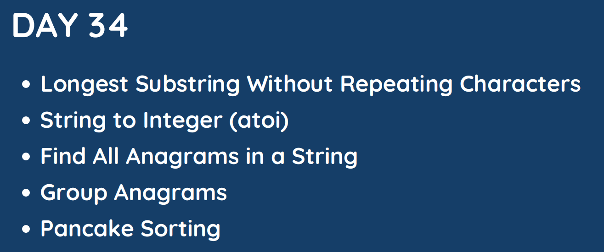

# Day 34

## [1. Longest Substring Without Repeating Characters](3.%20Longest%20Substring%20Without%20Repeating%20Characters.md)

## [2. String to Integer (atoi)](8.%20String%20to%20Integer%20(atoi).md)

## [3. Find All Anagrams in a String](438.%20Find%20All%20Anagrams%20in%20a%20String.md)

## [4. Group Anagrams]()

## [5. Pancake Sorting]()