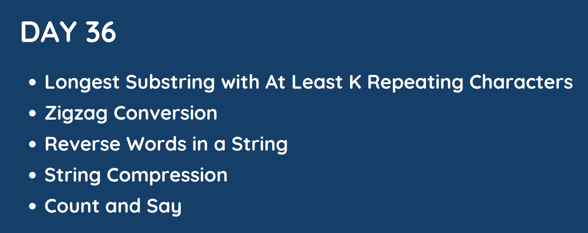

# Day 36

## [1. Longest Substring with At Least K Repeating Characters](395.%20Longest%20Substring%20with%20At%20Least%20K%20Repeating%20Characters.md)

## [2. Zigzag Conversion](6.%20Zigzag%20Conversion.md)

## [3. Reverse Words in a String](151.%20Reverse%20Words%20in%20a%20String.md)

## [4. String Compression](443.%20String%20Compression.md)

## [5. Count and Say]()