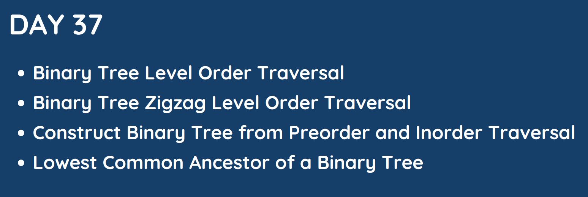

# Day 37

## [1. Binary Tree Level Order Traversal](102.%20Binary%20Tree%20Level%20Order%20Traversal.md)

## [2. Binary Tree Zigzag Level Oreder Traversal](103.%20Binary%20Tree%20Zigzag%20Level%20Order%20Traversal.md)

## [3. Construct Binary Tree from Preorder and Inorder Traversal](105.%20Construct%20Binary%20Tree%20from%20Preorder%20and%20Inorder%20Traversal.md)

## [4. Lowest Common Ancestor of a Binary Tree](236.%20Lowest%20Common%20Ancestor%20of%20a%20Binary%20Tree.md)