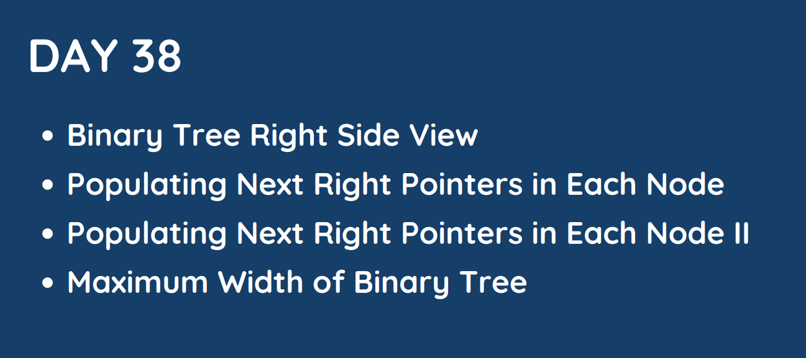

# Day 38 

## [1. Binary Tree Right Side View](199.%20Binary%20Tree%20Right%20Side%20View.md)

## [2. Populating Next Right Pointers in Each Node](116.%20Populating%20Next%20Right%20Pointers%20in%20Each%20Node.md)

## [3. Populating Next Right Pointers in Each Node II](117.%20Populating%20Next%20Right%20Pointers%20in%20Each%20Node%20II.md)

## [4. Maximum Width of Binary Tree](662.%20Maximum%20Width%20of%20Binary%20Tree.md)