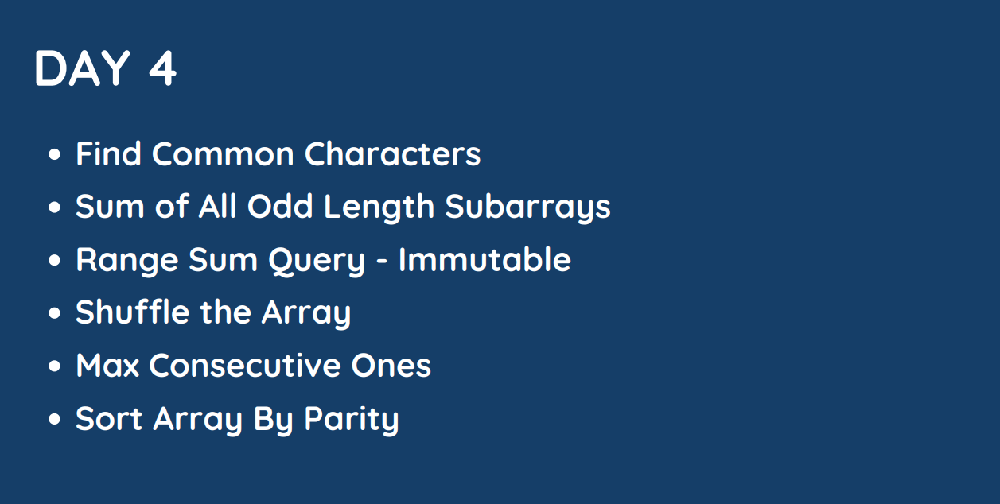

# Day : 4

## [Question 1](#question-1): [Find Common Characters](https://leetcode.com/problems/find-common-characters/)

> Given a string array `words`, return an array of all characters that show up in all strings within the `words` (*including duplicates*). You may return the answer in **any order**.

**Example 1:**

&nbsp; **Input:** words = ["bella","label","roller"]

&nbsp; **Output:** ["e","l","l"]

**Example 2:**

&nbsp; **Input:** words = ["cool","lock","cook"]

&nbsp; **Output:** ["c","o"]
 

**Constraints:**

* `1 <= words.length <= 100`
* `1 <= words[i].length <= 100`
* `words[i]` consists of lowercase English letters.

## Solution :

**Approach:**

The approach used in this code is to find the minimum occurrence of each character in all the given words. The common characters are then the ones that have the minimum occurrence of 1.

**Algorithm:**

1. Initialize a vector `falfa` of `26` integers, where each integer represents the minimum occurrence of a character in all the given words. Initialize all elements of `falfa` to `INT_MAX`.
2. For each word in the given words array:
    * Create a vector alfa of `26` integers, where each integer represents the occurrence of a character in the current word. Initialize all elements of `alfa` to `0`.
    * For each character in the current word:
        * Increment the count of the corresponding character in `alfa`.
1. For each element in falfa:
    * Update `falfa[i]` to the minimum of `falfa[i]` and the corresponding element in alfa.
1. Create a vector common to store the common characters.
1. For each element in `falfa`:
    * If the element is `1`, then add the corresponding character to common.

**Implementation:**

The following is the implementation of the algorithm in C++:
    
    vector<string> commonChars(vector<string>& words) {
        vector<int> falfa (26, INT_MAX);
        
        for(auto word : words){
            int alfa[26] = {0};
            
            for(auto c : word)
                alfa[c - 'a']++;

            for(auto i=0;i<26;i++)
                falfa[i] = min(falfa[i],alfa[i]);
        }
        
        vector<string> common;
        f
        or(auto i = 0 ; i < 26 ; i++)
            for(auto j = 0 ; j < falfa[i] ; j++)
                common.push_back(string(1,i+'a'));
        
        return common;
    }

## [Question 2](#question-2): [Sum of All Odd Length Subarrays](https://leetcode.com/problems/sum-of-all-odd-length-subarrays/)

> Given an array of positive integers `arr`, return the sum of all possible odd-length subarrays of `arr`.

A subarray is a *contiguous subsequence* of the array.

**Example 1:**

&nbsp; **Input:** arr = [1,4,2,5,3]

&nbsp; **Output:** 58

&nbsp; **Explanation:** The odd-length subarrays of arr and their sums are:
- [1] = 1
- [4] = 4
- [2] = 2
- [5] = 5
- [3] = 3
- [1,4,2] = 7
- [4,2,5] = 11
- [2,5,3] = 10
- [1,4,2,5,3] = 15
If we add all these together we get 1 + 4 + 2 + 5 + 3 + 7 + 11 + 10 + 15 = 58

**Example 2:**

&nbsp; **Input:** arr = [1,2]

&nbsp; **Output:** 3

&nbsp; **Explanation:** There are only 2 subarrays of odd length, [1] and [2]. Their sum is 3.

**Example 3:**

&nbsp; **Input:** arr = [10,11,12]

&nbsp;  **Output:** 66
 

**Constraints:**
* `1 <= arr.length <= 100`
* `1 <= arr[i] <= 1000`
 

**Follow up:**

*Could you solve this problem in `O(n)` time complexity?*

## Solution

**Approach:**

The approach of the code is to iterate over all the subarrays of odd length in the given array. A subarray is a contiguous sequence of elements in an array. The length of a subarray is the number of elements in the subarray.

To iterate over all the subarrays of odd length, the code first calculates the total number of such subarrays. This is done by multiplying the size of the array `(n)` by `(n - i + 1)`, where i is the index of the current element in the array.

*For example*, if the array has 5 elements, then the number of subarrays of odd length is `5 * 4 = 20`. This is because there are `20` subarrays of odd length in the array, namely:

    [0]
    [1]
    [2]
    [3]
    [4]
    [0, 1]
    [0, 2]
    [0, 3]
    [0, 4]
    [1, 2]
    [1, 3]
    [1, 4]
    [2, 3]
    [2, 4]
    [3, 4]
Once the total number of subarrays of odd length is calculated, the code iterates over all the subarrays and sums the elements in each subarray. The sum of all the elements in all the subarrays is then returned as the answer.

**Algorithm:**

The algorithm of the code can be broken down into the following steps:

1. Calculate the total number of subarrays of odd length.
1. Iterate over all the subarrays of odd length.
1. For each subarray, sum the elements in the subarray.
1. Return the sum of all the elements in all the subarrays.

**Here is an implementation of the algorithm in C++:**

    int sumOddLengthSubarrays(vector<int>& arr) {
    int size = arr.size();

    int totalSum = 0;
    for (int i = 0; i < size; i++) {
        int times = (size - i) * (i + 1);
        int odd = times / 2;
        if (times % 2 != 0) {
        odd++;
        }
        totalSum += arr[i] * odd;
    }
    return totalSum;
    }

## [Question 3](#question-3): [Range Sum Query - Immutable](https://leetcode.com/problems/range-sum-query-immutable/)
> Given an integer array `nums`, handle multiple queries of the following type:

Calculate the sum of the elements of `nums` between indices `left` and `right` inclusive where `left <= right`.
Implement the `NumArray` class:

* `NumArray(int[] nums)` Initializes the object with the integer array nums.
* `int sumRange(int left, int right)` Returns the sum of the elements of nums between indices left and right inclusive (i.e. `nums[left] + nums[left + 1] + ... + nums[right]`).
 

**Example 1:**

&nbsp; **Input**
- ["NumArray", "sumRange", "sumRange", "sumRange"]
- [[[-2, 0, 3, -5, 2, -1]], [0, 2], [2, 5], [0, 5]]

&nbsp; **Output**
[null, 1, -1, -3]

Explanation:
- NumArray numArray = new NumArray([-2, 0, 3, -5, 2, -1]);
- numArray.sumRange(0, 2); // return (-2) + 0 + 3 = 1
- numArray.sumRange(2, 5); // return 3 + (-5) + 2 + (-1) = -1
- numArray.sumRange(0, 5); // return (-2) + 0 + 3 + (-5) + 2 + (-1) = -3
 

**Constraints:**

* `1 <= nums.length <= 104`
* `-105 <= nums[i] <= 105`
* `0 <= left <= right < nums.length`
* At most 104 calls will be made to `sumRange`.

## Solution

**Approach:**

The NumArray class maintains a vector nums to store the original array. It also has a private method `sumNums()` that calculates the cumulative sums of the elements in the array. This means that `nums[i]` stores the sum of all elements from `0` to `i` (inclusive).

The public method `sumRange()` takes two integers `left` and `right` as input and returns the sum of all elements from `left` to `right` (inclusive). This is done by simply subtracting `nums[left-1]` from `nums[right]`.

**Algorithm:**

The algorithm of the `sumRange()` method is as follows:

1. If left is 0, then the sum is simply `nums[right]`.
1. Otherwise, the sum is equal to `nums[right] - nums[left-1]`.

**Complexity:**

The time complexity of the `sumRange()` method is `O(1)`, since it only takes a constant amount of time to access the elements of the nums vector. The space complexity is also `O(1)`, since the nums vector only stores the original array.

Here is the C++ code for the `sumRange()` method:

    int sumRange(int left, int right) {
        if(left == 0)   return nums[right];
        return (nums[right] - nums[left-1]); 
    }

## [Question 4](#question-4): [Shuffle the Array](https://leetcode.com/problems/shuffle-the-array/)

>Given the array `nums` consisting of `2n` elements in the form `[x1,x2,...,xn,y1,y2,...,yn]`.

Return the `array` in the form `[x1,y1,x2,y2,...,xn,yn]`.

 

**Example 1:**

&nbsp; **Input:** nums = [2,5,1,3,4,7], n = 3

&nbsp; **Output:** [2,3,5,4,1,7] 

&nbsp; **Explanation:** Since x1=2, x2=5, x3=1, y1=3, y2=4, y3=7 then the answer is [2,3,5,4,1,7].

**Example 2:**

&nbsp; **Input:** nums = [1,2,3,4,4,3,2,1], n = 4

&nbsp; **Output:** [1,4,2,3,3,2,4,1]

**Example 3:**

&nbsp;  **Input:** nums = [1,1,2,2], n = 2

&nbsp; **Output:** [1,2,1,2]
 

**Constraints:**

* `1 <= n <= 500`
* `nums.length == 2n`
* `1 <= nums[i] <= 10^3`

## Solution

**Approach:**

The approach of this algorithm is to first create a temporary array that is twice the size of the original array. Then, for each element in the original array, the corresponding element in the temporary array is incremented by a large value (1001 in this case). This ensures that no two elements in the temporary array will have the same value.

Next, the elements in the temporary array are divided by the large value and stored back into the original array. This effectively shuffles the elements in the original array.

**Algorithm:**

The algorithm of this code can be broken down into the following steps:

1. Create a temporary array that is twice the size of the original array.
1. For each element in the original array, increment the corresponding element in the temporary array by a large value.
1. Divide each element in the temporary array by the large value and store it back into the original array.

**Implementation in C++:**

The following is the implementation of the algorithm in C++:

    vector<int> shuffle(vector<int>& nums, int n) {
    // Create a temporary array that is twice the size of the original array.
    vector<int> temp(2 * n);

    // For each element in the original array, increment the corresponding element in the temporary array by a large value.
    for (int i = 0; i < n; i++) {
        temp[i + n] = nums[i] + 1001;
    }

    // Divide each element in the temporary array by the large value and store it back into the original array.
    for (int i = 0; i < n; i++) {
        nums[2 * i] = temp[i + n] / 1001;
        nums[(2 * i) + 1] = temp[i + n] % 1001;
    }

    return nums;
    }

## [Question 5](#question-5): [Max Consecutive Ones](https://leetcode.com/problems/max-consecutive-ones/)

> Given a binary array `nums`, return the maximum number of consecutive `1's` in the array.

 

**Example 1:**

&nbsp; **Input:** nums = [1,1,0,1,1,1]

&nbsp; **Output:** 3

&nbsp; **Explanation:** The first two digits or the last three digits are consecutive 1s. The maximum number of consecutive 1s is 3.

**Example 2:**

&nbsp; **Input:** nums = [1,0,1,1,0,1]

&nbsp; **Output:** 2
 

**Constraints:**

* `1 <= nums.length <= 105`
* `nums[i] is either 0 or 1.`

## Solution

**Approach:**

The code uses a sliding window approach to find the maximum number of consecutive 1s in the array. The sliding window is a technique where we maintain a window of consecutive elements and update the maximum number of consecutive 1s whenever we see a 1. The window starts at the beginning of the array and moves one element at a time.

**Algorithm:**

1. Initialize two variables, consecutive and freq.
2. Set consecutive to 0.
3. Iterate over the array:
    * If the current element is 1, then:
        * Increment freq.
        * Set consecutive to the maximum of consecutive and freq.
    * Otherwise, set freq to 0.
4. Return consecutive.

**Implementation in C++:**

The following is the implementation of the algorithm in C++:

    int findMaxConsecutiveOnes(vector<int>& nums) {
        int consecutive = 0;
        int freq = 0;
        
        for(int num : nums)
            if(num == 1)
                consecutive = max(consecutive, ++freq);
            else freq = 0;
        
        return consecutive;
    }   

**Here is a more detailed explanation of the algorithm:**

1. The consecutive variable keeps track of the maximum number of consecutive 1s in the current window.
1. The freq variable keeps track of the number of consecutive 1s in the current window.
1. In the for loop, we iterate over the array.
1. If the current element is 1, then we increment freq. This means that we have found another consecutive 1.
1. We then set consecutive to the maximum of consecutive and freq. This ensures that we always keep track of the maximum number of consecutive 1s.
1. Otherwise, if the current element is 0, then we set freq to 0. This means that we have broken the current window of consecutive 1s.
1. Finally, we return consecutive. This is the maximum number of consecutive 1s in the array.

## [Question 6](#question-6): [Sort Array By Parity](https://leetcode.com/problems/sort-array-by-parity/)

> Given an integer array `nums`, move all the even integers at the beginning of the array followed by all the odd integers.

Return any array that satisfies this condition.

 

**Example 1:**

&nbsp; **Input:** nums = [3,1,2,4]

&nbsp; **Output:** [2,4,3,1]

&nbsp; **Explanation:** The outputs [4,2,3,1], [2,4,1,3], and [4,2,1,3] would also be accepted.

**Example 2:**

&nbsp; **Input:** nums = [0]

&nbsp; **Output:** [0]
 
**Constraints:**

* 1 <= nums.length <= 5000
* 0 <= nums[i] <= 5000

## Solution

**Approach:**

The approach is to scan the array from left to right. If the current element is even, swap it with the element at the even-indexed position (which is j). This ensures that all the even elements are placed at the beginning of the array, and all the odd elements are placed at the end of the array.

**Algorithm:**

1. Initialize a variable `j` to 0. This will be the index of the next even-indexed position in the array.
2. Iterate through the array from left to right.
    * If the current element is even, swap it with the element at index `j`.
    * Increment `j` by 1.
3. Return the array. 

Here is the detailed explanation of the code:

    class Solution {
    public:
        vector<int> sortArrayByParity(vector<int>& nums) {
            int n = nums.size();
            // vector<int> res(n);
            int j = 0;
            for(int i = 0 ; i < n ; i++){
                if(nums[i]%2 == 0){
                    swap(nums[i],nums[j++]);
                }
            }

            return nums;
        }
    };
* The first line declares the `Solution` class.
* The second line declares the `sortArrayByParity()` method. This method takes an array of integers as input and returns a sorted array where all the even elements are placed before all the odd elements.
* The third line declares the variable `n`, which stores the length of the array.
* The fourth line declares the variable `j`, which stores the index of the next even-indexed position in the array.
* The fifth line is a for loop that iterates through the array from left to right.
    * The sixth line checks if the current element is even.
        * If it is, the seventh line swaps the current element with the element at index `j`.
        * The eighth line increments `j` by 1.
* The ninth line returns the array.
