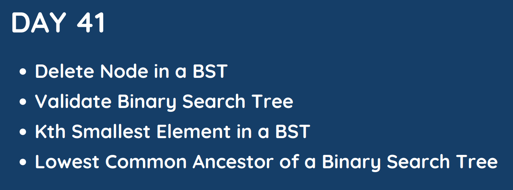

# Day 41

## [1. Delete Node in a BST](450.%20Delete%20Node%20in%20a%20BST.md)

## [2. Validate Binary Search Tree](98.%20Validate%20Binary%20Search%20Tree.md)

## [3. Kth Smallest Element in a BST](230.%20Kth%20Smallest%20Element%20in%20a%20BST.md)

## [4. Lowest Common Ancestor of a Binary Search Tree]()