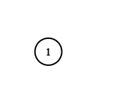

# [133. Clone Graph](https://leetcode.com/problems/clone-graph/)

Given a reference of a node in a [connected](https://en.wikipedia.org/wiki/Connectivity_(graph_theory)#Connected_graph) undirected graph.

Return a [deep copy](https://en.wikipedia.org/wiki/Object_copying#Deep_copy) (clone) of the graph.

Each node in the graph contains a value (`int`) and a list (`List[Node]`) of its neighbors.

>```
>class Node {
>    public int val;
>    public List<Node> neighbors;
>}
>```
 

**Test case format:**

For simplicity, each node's value is the same as the node's index (1-indexed). For example, the first node with `val == 1`, the second node with `val == 2`, and so on. The graph is represented in the test case using an adjacency list.

An adjacency list is a collection of unordered lists used to represent a finite graph. Each list describes the set of neighbors of a node in the graph.

The given node will always be the first node with `val = 1`. You must return the copy of the given node as a reference to the cloned graph.

 


**Example 1:**


>**Input:** adjList = [[2,4],[1,3],[2,4],[1,3]]<br>
**Output:** [[2,4],[1,3],[2,4],[1,3]]<br>
**Explanation:** There are 4 nodes in the graph.<br>
1st node (val = 1)'s neighbors are 2nd node (val = 2) and 4th node (val = 4).<br>
2nd node (val = 2)'s neighbors are 1st node (val = 1) and 3rd node (val = 3).<br>
3rd node (val = 3)'s neighbors are 2nd node (val = 2) and 4th node (val = 4).<br>
4th node (val = 4)'s neighbors are 1st node (val = 1) and 3rd node (val = 3).

**Example 2:**



>**Input:** adjList = [[]]<br>
**Output:** [[]]<br>
**Explanation:** Note that the input contains one empty list. The graph consists of only one node with val = 1 and it does not have any neighbors.

**Example 3:**

>**Input:** adjList = []<br>
**Output:** []<br>
**Explanation:** This an empty graph, it does not have any nodes.
 

**Constraints:**

- The number of nodes in the graph is in the range `[0, 100]`.
- `1 <= Node.val <= 100`
- `Node.val` is unique for each node.
- There are no repeated edges and no self-loops in the graph.
- The Graph is connected and all nodes can be visited starting from the given node.
---
# Solution

The approach to the solution is to use a recursive DFS traversal of the graph. As we traverse the graph, we create a clone of each node and store it in a hashmap. We also recursively clone the neighbors of each node.

The algorithm is as follows:

1. Create a hashmap to store the cloned nodes.
2. Define a recursive function `dfs()`, which takes a node as input and returns a clone of that node.
3. In the `dfs()` function:
    * If the node is already cloned, return the cloned node.
    * Otherwise, create a new clone of the node and store it in the hashmap.
    * Recursively clone the neighbors of the node and add them to the clone's neighbor list.
    * Return the clone of the node.
4. Call the `dfs()` function on the root node of the graph.
5. Return the cloned root node.

Here is a C++ implementation of the above algorithm:

```c++
class Solution {
    unordered_map<Node*, Node*> mp;

    Node* dfs(Node* node){
        vector<Node*> neighbors;
        Node *clone = new Node(node->val);
        mp[node] = clone;

        for(auto it : node->neighbors){
            if(mp.count(it)){
                neighbors.push_back(mp[it]);
            }else{
                neighbors.push_back(dfs(it));
            }
        }
        clone->neighbors = neighbors;
        return clone;
    }
public:
    Node* cloneGraph(Node* node) {
        if(node == NULL) return NULL;

        if(node->neighbors.size() == 0){
            Node* clone = new Node(node->val);
            return clone;
        }
        return dfs(node);
    }
};
```

This algorithm has a time complexity of O(V + E), where V is the number of nodes in the graph and E is the number of edges in the graph. The space complexity of the algorithm is O(V), since we need to store the cloned nodes in a hashmap.