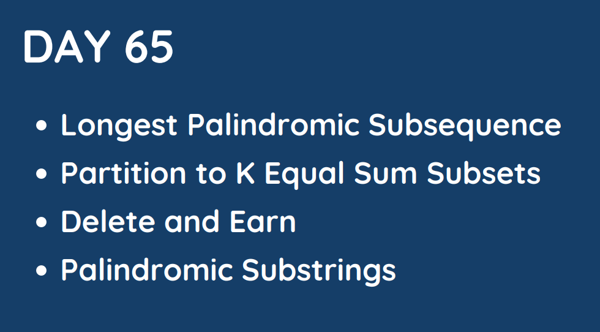

# Day 65

## [1. Longest Palindromic Subsequence](516.%20Longest%20Palindromic%20Subsequence.md)

## [2. Partition to K Equal Sum Subsets](698.%20Partition%20to%20K%20Equal%20Sum%20Subsets.md)

## [3. Delete and Earn](740.%20Delete%20and%20Earn.md)

## [4. Palindromic Substrings](647.%20Palindromic%20Substrings.md)