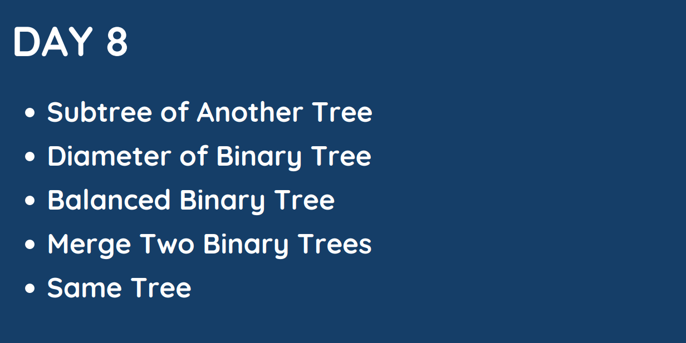

# Day : 8

## [1. Sub tree of Another tree](572.%20Subtree%20of%20Another%20Tree.md)

## [2. Diameter of Binary Tree](543.%20Diameter%20of%20Binary%20Tree.md)

## [3. Balanced Binary Tree](110.%20Balanced%20Binary%20Tree.md)

## [4. Merge Two Binary Trees](617.%20Merge%20Two%20Binary%20Trees.md)

## [5. Same Tree](100.%20Same%20Tree.md)