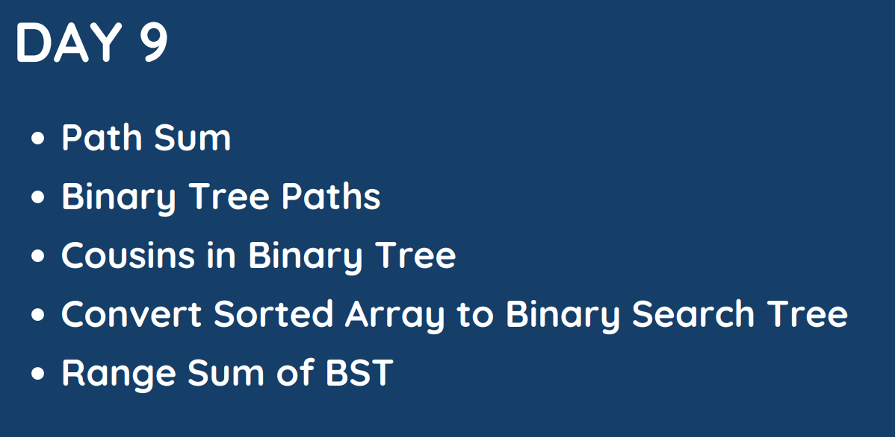

# Day: 9

## [1. Path Sum](112.%20Path%20Sum.md)

## [2. Binary Tree Paths](257.%20Binary%20Tree%20Paths.md)

## [3. Cousins in Binary Tree](993.%20Cousins%20in%20Binary%20Tree.md)

## [4. Convert Sorted Array to Binary Search Tree](108.%20Convert%20Sorted%20Array%20to%20Binary%20Search%20Tree.md)

## [5. Range Sum Of BST](938.%20Range%20Sum%20of%20BST.md)